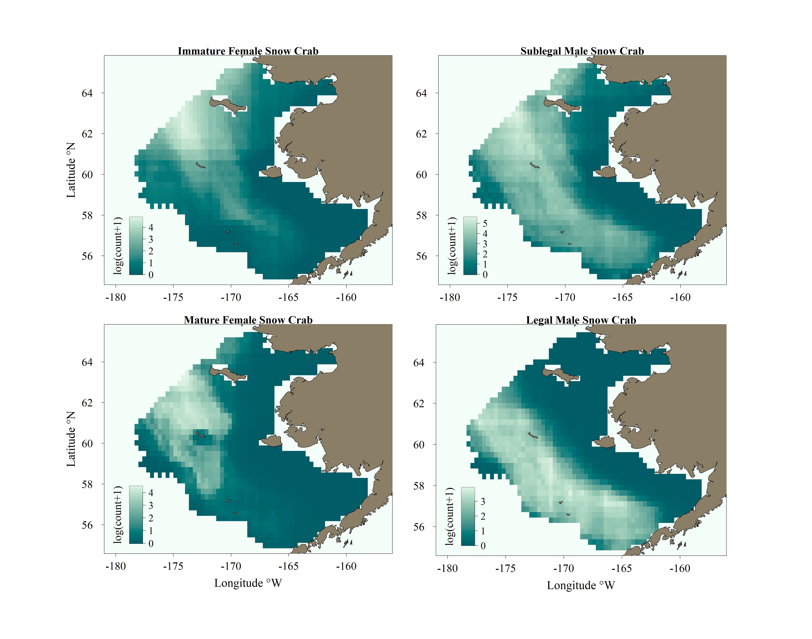
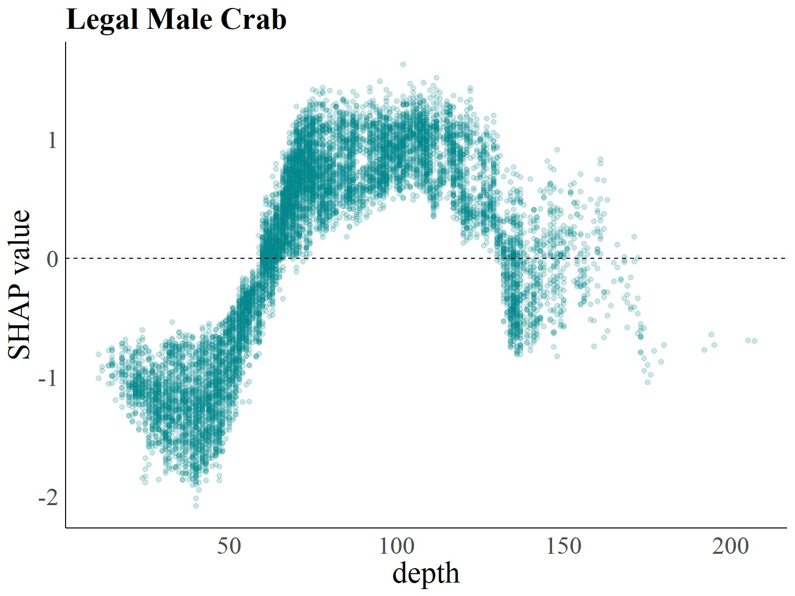

# Modeling Distributions of Bering Sea Snow Crab

This is part of a NOAA funded project that creates updated species distribution maps for snow crab in the northern Bering Sea. This repository serves as a tool to continue to create updated SDMs for snow crab by sex and maturity as well as forecast next-season summer distributions. A portion of this work comprises a chapter of my Ph.D. dissertation.

### Data
Both fishery-independent, fishery-dependent, and oceanographic data were used for this project, along with ROMS output from the Bering10K. Data cleaning and matching processes can be seen [here](code/data_matching.R), though data are not accessible through this respository and must be independently obtained. Some data are confidential and others must be requested. Specifically, we use:
- The **Alaska Department of Fish and Game Crab Observer Program** data,  which are  __confidential__. These data include records of catches of snow crab in the targeted fishery as well as bycatch in other crab fisheries. The fisheries for crab typically occur from December to March. These data were incorporated as PCA scores, through these [methods](code/observer_PCA.R). These PCA results look like this for legal size male snow crab: 
- The NOAA AFSC **Eastern Bering Sea Bottom Trawl Survey** data, which includes catches of snow crab at stations sampled by this survey. Data are available beginning in 1975 and surveys run during the summer months.  May be available upon request. 
- The **Bering10K ROMS** output. We are using the latest CMIP6 runs to obtain values for temperature in order to predict next season distributions. These outputs are [publicly available](https://beringnpz.github.io/roms-bering-sea/B10K-dataset-docs/). 
- The **ERA5 Reanalysis** sea ice concentration monthly values. 
- The **NOAA Eastern Bering Sea sediment database**, which provides a comprehensive set of grain sizes in the study region at a 1 km resolution. Sediment grain size is distributed like this for the study region: 

### Methods
 Different types of species distribution models (SDM) were compared in order to select the best model. Root mean square error (RMSE), Spearman's correlation coefficient, and percent deviance explained were used to compare the models. Training data used data from 1995-2014 and test data included 2015-2019 and 2021. Ultimately, boosted regression trees were selected. This process can be replicated [here](code/model_evaluation.R). An example of this comparison can be seen through this RMSE plot:

#### Generalized Additive Models (GAMs)
Two types of GAMs were evaluated for use as SDMs for snow crab.
1. Delta-type GAMs model presence-absence first using a Bernoulli distribution. Then abundance-only data is log(x+1) transformed and modeled using a Gaussian distribution. Predicted abundance is conditional on the presence-absence from the first model, meaning the predictions from each are multiplied to obtain the final predictions.
2. GAMs using the full set of log transformed data using a Tweedie distribution with a log link. This is a type of Poisson-gamma compound model.

#### Boosted Regression Trees (BRTs) 
Delta-type BRTs were developed in a  similar manner to the delta-type GAMs. Predicted abundance for these models was also conditional on the presence-absence from the Bernoulli model. The final predicted plots of distribution look like this:

#### Spatial Error
RMSE values were calculated spatially for each sex/maturity model using two different sets of train/test data. First, the original train/test data sets were used to calculate both spatial and overall RMSE. Then the models were retrained using train data that incorporated 2018 and test data that no longer included 2018. Spatial and overall RMSE values were then recalculated and compared to the initial values. This can be replicated [here](code/model_spatial_error.R).

#### SHAP values 
Shapley values are commonly used in other fields to  explain outputs from machine  learning models, but have only recent been applied in SDM contexts.  Here, we use the SHAP implementation through the [FastSHAP package](https://cran.r-project.org/web/packages/fastshap/index.html) and combine the SHAP values from each part of the delta-type BRT through the [mshap package](https://cran.r-project.org/web/packages/mshap/index.html). Values above zero indicate positive effects on abundance from a given variable while those below zero indicate a negative effect. The greater the SHAP value, the greater the magnitude. SHAP can also be visualized spatially with various variable SHAP values added on top of the spatial SHAP values. The SHAP calculation process is done at the end of [this script](code/model_evaluation.R). 
